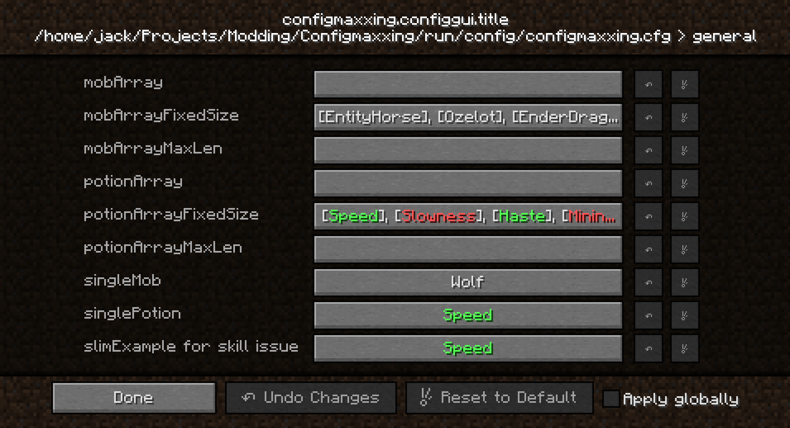
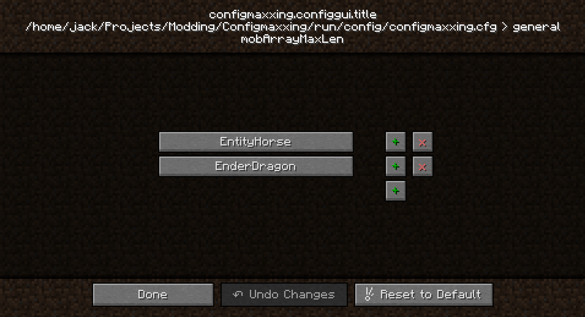
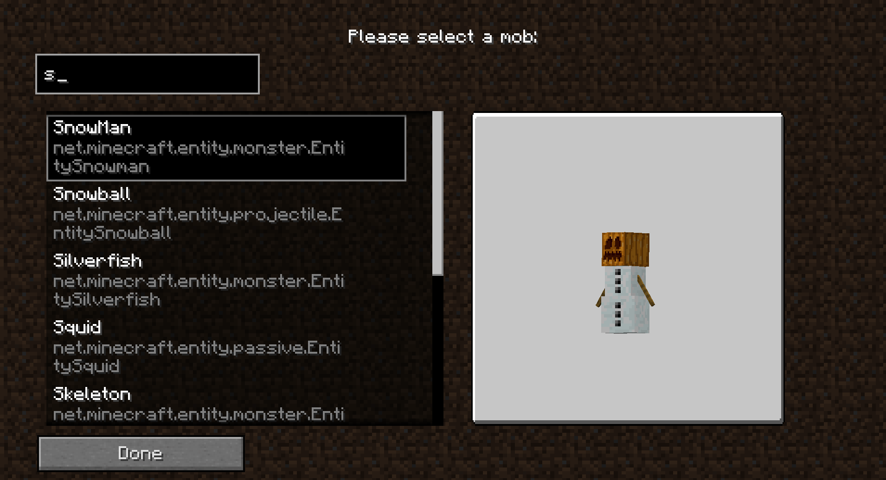
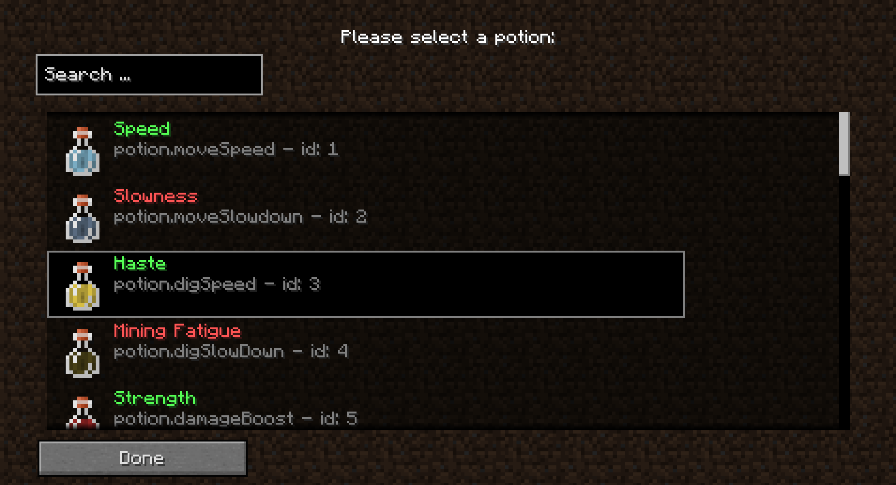

# ConfigMaxxing library mod for Minecraft Forge 1.7.10


### What is this?
It is a library mod adding "graphical wrappers" for Forge config value selectors. For now there is a potion and mob picker available. The usage is pretty simple to figure out by looking inside the mod's code. Its also pretty easy to implement your own pickers, the examples are pretty self-explanatory. Pull requests with pickers are welcome.


### Will you port it to [insert abandonware/meme version]?
It's free real estate. Do it (for free).

### How to build?
`gradlew build` should do the trick.

## License
`LgplV3 + SNEED`

## Contact
* Matrix: `#boysgregified:matrix.thisisjoes.site`.
* Website: [mcdrama.net](https://www.mcdrama.net/articles/mods.html).
* This project [GitHub repo](https://github.com/trollogyadherent/ConfigMaxxing).

## Credits
* [FalsePattern](https://github.com/FalsePattern), [SinTh0r4s](https://github.com/SinTh0r4s), [basdxz](https://github.com/basdxz), and [TheElan](https://github.com/TheElan) for their [ExampleMod 1.7.10](https://github.com/FalsePattern/ExampleMod1.7.10) and the included gradle buildscript.
* The mob 3D render code was taken from [bspkrsCore](https://github.com/bspkrs-mods/bspkrsCore) ([CC BY-NC-SA 3.0](https://creativecommons.org/licenses/by-nc-sa/3.0/)), by [bspkrs](https://github.com/bspkrs-mods).

<br>

### More pictures:




<br>

## Usage examples:

### Adding a potion picker to your config:
You need to have a `String` or `String Array` config entry. In this example it will be an array:
```java
public static String[] potionArray = {};
```
To make it use the potion picker, one needs to use Forge's inbuilt `setConfigEntryClass` on the config property. It also needs to be done on the client solely (also a limitation of Forge).
```java
Property potionArrayProperty = config.get(Categories.examples, "potionArray", Defaults.potionArray, "Example list of potions.");
if (!Util.isServer()) {
    potionArrayProperty.setConfigEntryClass(PotionEntryPoint.class);
}
potionArray = potionArrayProperty.getStringList();
```
Similarly, `MobEntryPoint.class` can be used for the mob picker instead. `Util.isServer()` is available in the utils class and is just a shorthand for `FMLCommonHandler.instance().getSide() == Side.SERVER`.
<br>
The GUI here is purely visual, and you end up with a list of strings in the config:
```
# Example list of potions.
S:potionArray <
    potion.moveSpeed
    potion.moveSlowdown
    potion.digSpeed
    potion.digSlowDown
    potion.damageBoost
 >
```
`Potion` objects can be retrieved from such a potion name using the `PotionUtil.getPotionByName(String name)` method. It is simply iterating over the potion registry while ignoring null entries present in it. `MobUtils` have a similar functionality, for more details about retrieving a mob from a mob name, take a look at the `setMob` method in `MobRenderTicker`.
<br>
It is fairly trivial to extend a picker or make one yourself. A picker consists of three classes: An entry point class, a selection gui class, and an entry list class.
The first class tells how values should be formatted when rendered on buttons, and also which class to use for the picker GUI. It extends `EntryPoint`.
The second class is the main picker GUI class containing the list and any other widgets you wish (for example the mob picker also has a mob preview panel). It extends the `CommonSelectionGui` class. Take a look at `PotionSelectionGui` for an easy example.
The third class represents an single entry in the list. The entry render code is situated there. It extends `ListEntry`.
<br>
There is a the `potionslim` package demonstrating an extension of the potion picker that renders potions in the list two times smaller and only with the main potion names.


